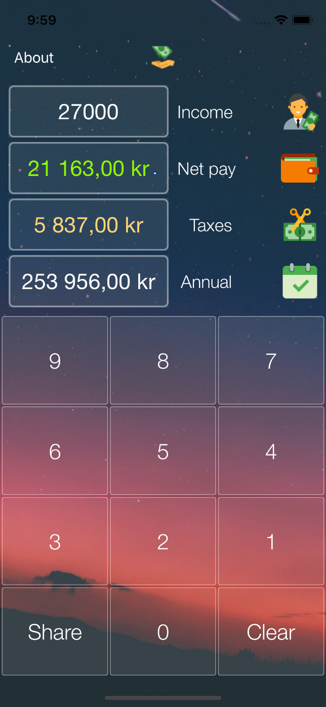
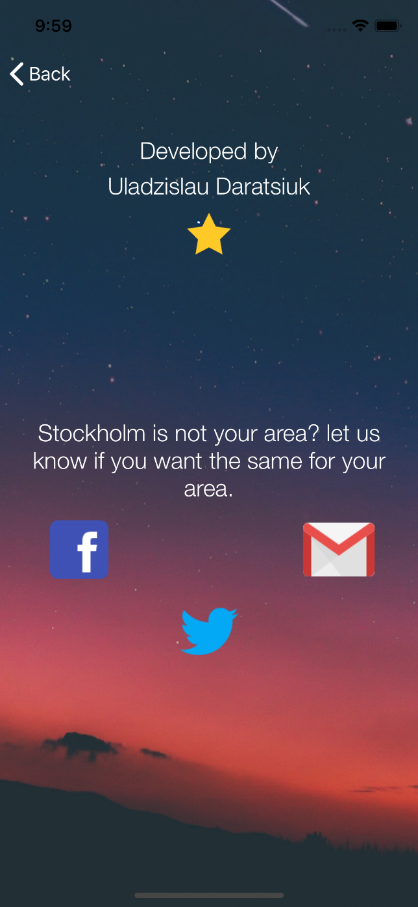

# STH-Skatter
Our Application that's a simple way to get information about your clean income in Stockholm Area in 2018.
That application was created in Xcode 9.2 and with Swift 4.0.3.

<h2>Released in AppStore in 2017</h2>

  
1st Main Screen
  

  
2nd About Screen
  

